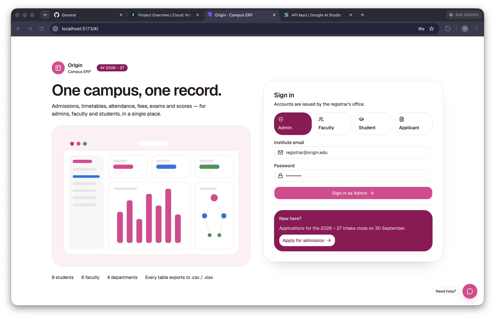
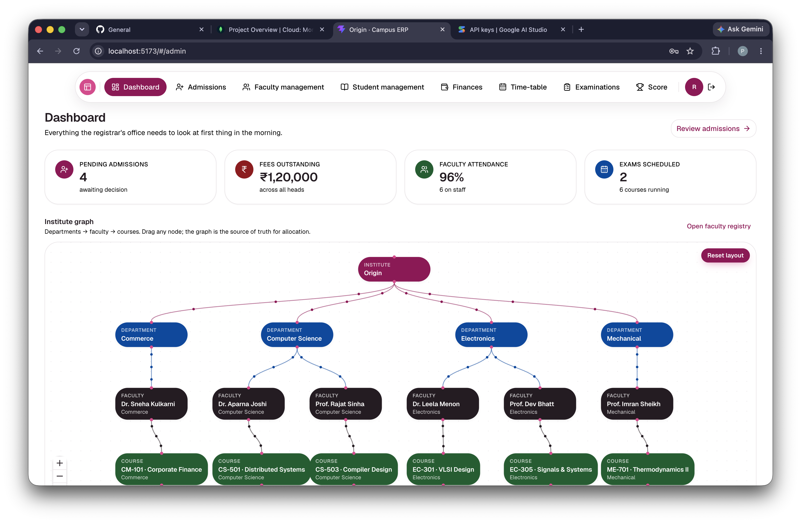
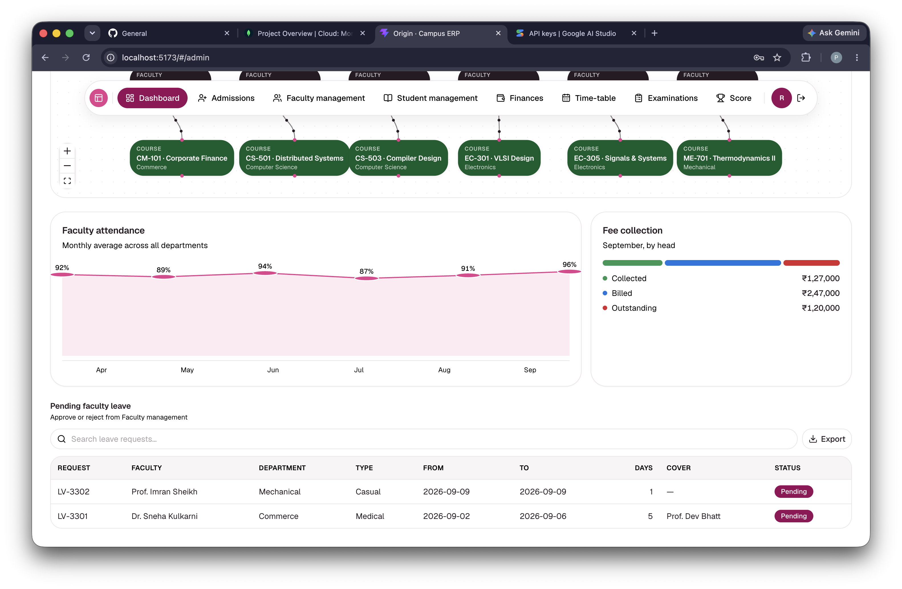
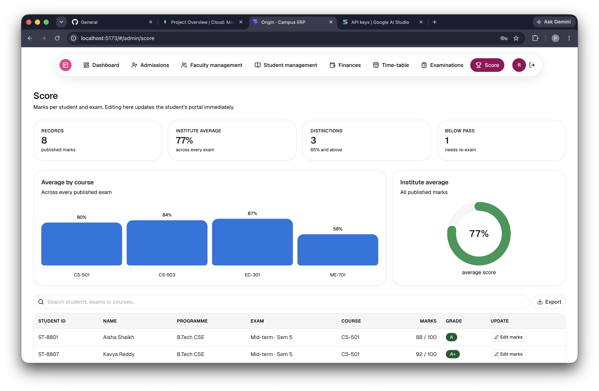
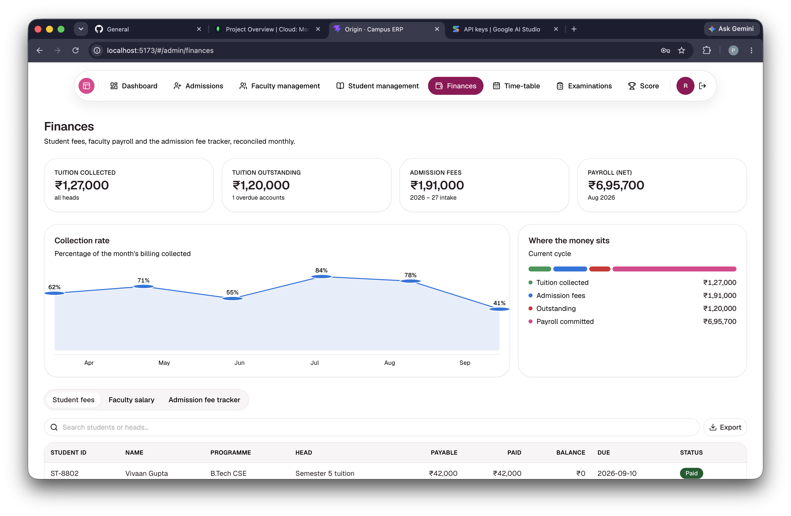
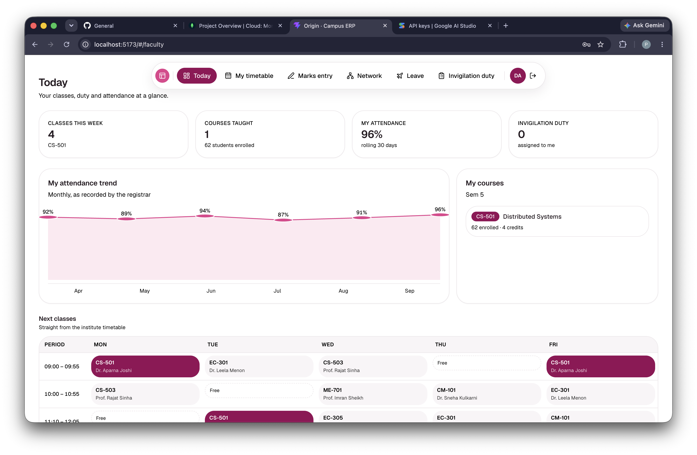
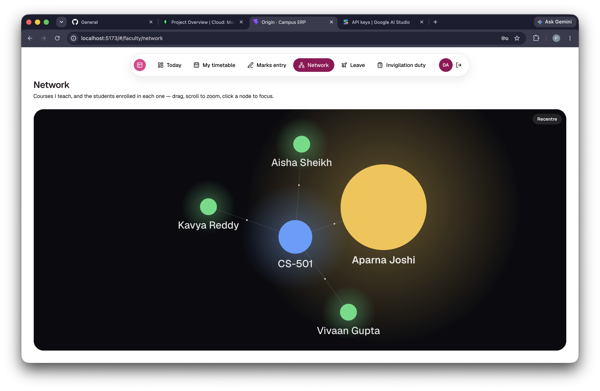
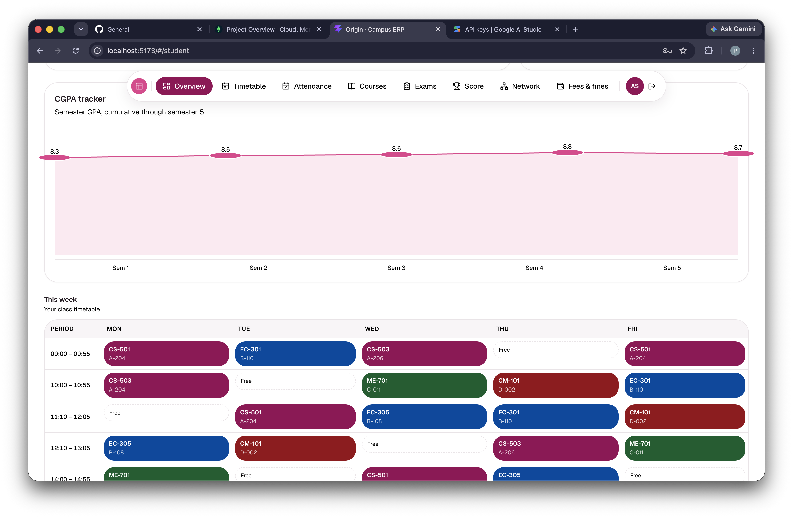
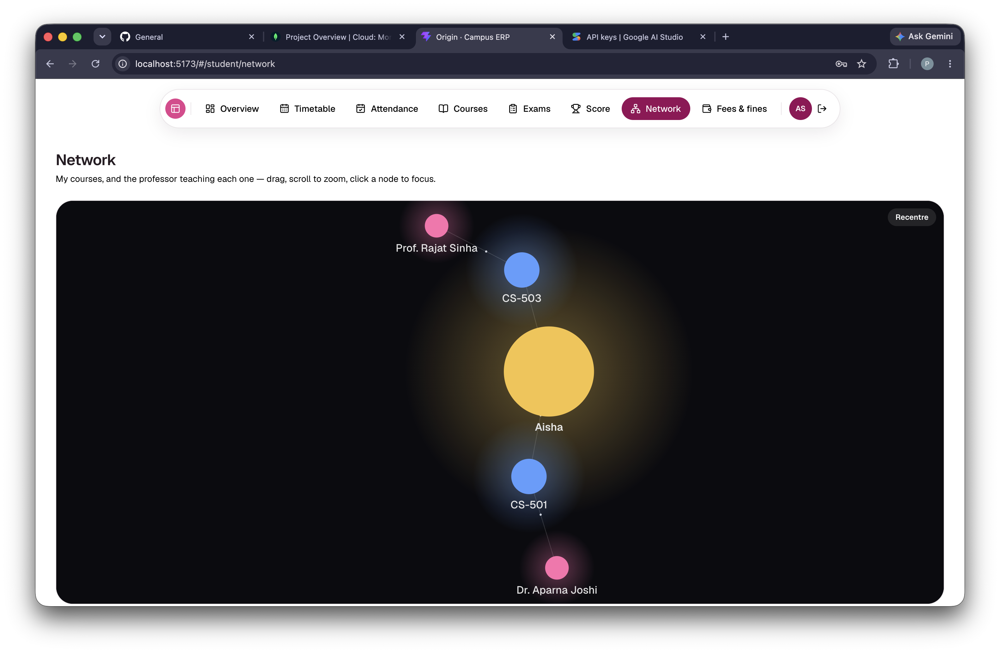

# Origin — Campus ERP

A campus ERP web app with four interfaces — Admin, Faculty, Student and Applicant — covering admissions, timetables, attendance, fees, examinations and scores.

| Name | Registration Number |
| --- | --- |
| Parth Pancholi | 25BCE10443 |
| Adarsh Pratap Singh | 25BCE10285 |
| Disha Dashore | 25BAI10444 |

## Deployment Link

[https://your-deployment-link.example.com](https://your-deployment-link.example.com)

## Table of Contents

- [Screenshots](#screenshots)
- [Features](#features)
- [Tech Stack](#tech-stack)
- [Project Structure](#project-structure)
- [Prerequisites](#prerequisites)
- [Setup Instructions](#setup-instructions)
- [Environment Variables](#environment-variables)
- [Available Scripts](#available-scripts)
- [Populating Data](#populating-data)
- [Security Notes](#security-notes)
- [Troubleshooting](#troubleshooting)

## Screenshots

### Login



### Admin






### Faculty




### Student




## Features

- Role-based sign-in for Admin, Faculty, Student and Applicant from one login page
- Admissions pipeline with approvals, rejections and a fee tracker
- Faculty directory, leave, attendance, salary and invigilation duty
- Student directory, attendance, fees, fines, courses and scores
- A time-table that regenerates around teacher availability and approved leave
- Per-exam marks entry for faculty
- Finance dashboards for tuition, admission fees and payroll
- Force-directed network graphs of courses, faculty and students
- A React Flow institute organisation chart on the admin dashboard
- CSV/XLSX export on every data table
- An AI chatbot (Gemini) on the login page

## Tech Stack

**Frontend** — React 19, React Router, Vite, Tailwind CSS v4, shadcn/ui, Framer Motion, React Flow, `react-force-graph-2d`, `xlsx`

**Backend** — Node.js, Express 5, MongoDB, Mongoose 9, Google Gemini API, Node's built-in test runner

## Project Structure

```
origin/
├── backend/     Express + MongoDB API server
│   ├── db/       Database connection
│   ├── lib/       Shared helpers
│   ├── models/    Mongoose schemas
│   ├── routers/   API routes, mounted under /api
│   ├── scripts/   One-off scripts (consistency audit)
│   └── test/      Backend test suite
├── frontend/     React + Vite app
│   └── src/       components, lib, pages
├── images/       README screenshots
└── docs/         Planning notes
```

## Prerequisites

- Node.js 20+ (`node --version`)
- npm (bundled with Node)
- MongoDB, local or hosted (e.g. Atlas)
- Git
- A Google Gemini API key (optional — only needed for the chatbot)

## Setup Instructions

**1. Clone the repository**

```bash
git clone <this-repository-url>
cd origin
```

**2. Start MongoDB**

Install MongoDB Community Edition and start it, or use a hosted connection string (Atlas):

```bash
brew services start mongodb-community   # macOS
sudo systemctl start mongod             # Linux
```

**3. Set up the backend**

```bash
cd backend
npm install
```

Optionally create `backend/.env` (see [Environment Variables](#environment-variables)):

```bash
GEMINI_API_KEY=
# MONGODB_URI=mongodb://localhost:27017
# MONGODB_DB=myDatabase
# PORT=8000
```

```bash
npm run dev
# Connected successfully to the database "myDatabase"
# Server initialized on port 8000
```

**4. Create the first admin account**

There is no seed script — the database starts empty, and only an admin can create everyone else. Insert one directly:

```bash
mongosh "mongodb://localhost:27017/myDatabase"
```

```javascript
db.users.insertOne({
  email: "admin@origin.edu",
  password: "admin123",
  name: "Admin",
  role: "admin",
  linkedId: "",
});
```

**5. Set up the frontend**

In a second terminal:

```bash
cd frontend
npm install
npm run dev
```

Open the printed URL (typically `http://localhost:5173/#/`). If the backend runs elsewhere, set `VITE_API_URL` in `frontend/.env`.

**6. Sign in**

Sign in as Admin with the credentials from step 4, then use "Add teacher" / "Add student" to build out the rest of the data (see [Populating Data](#populating-data)).

## Environment Variables

| Variable | Where | Default | Description |
| --- | --- | --- | --- |
| `GEMINI_API_KEY` | `backend/.env` | none | Powers the login chatbot; falls back to a support message without it |
| `MONGODB_URI` | `backend/.env` | `mongodb://localhost:27017` | MongoDB connection string |
| `MONGODB_DB` | `backend/.env` | `myDatabase` | Database name |
| `PORT` | `backend/.env` | `8000` | API server port |
| `CORS_ORIGIN` | `backend/.env` | any origin | Restricts allowed frontend origins |
| `VITE_API_URL` | `frontend/.env` | `http://localhost:8000` | Backend URL the frontend calls |

## Available Scripts

**Backend**

| Command | Description |
| --- | --- |
| `npm run dev` | API server with auto-restart |
| `npm start` | API server, no auto-restart |
| `npm test` | Run the test suite |
| `npm run test:watch` | Test suite in watch mode |
| `npm run audit` | Print data-consistency findings (`--fix` to reconcile) |

**Frontend**

| Command | Description |
| --- | --- |
| `npm run dev` | Vite dev server |
| `npm run build` | Production build to `frontend/dist/` |
| `npm run preview` | Serve the production build locally |
| `npm run lint` | ESLint |

## Populating Data

1. **Faculty management → Add teacher** — creates a faculty login automatically
2. **Apply for admission** (login page) → approve in **Admissions** → pay the seat fee to issue a student login
3. **Examinations → Create exam**
4. **Faculty portal → Marks entry** — enter scores as that faculty member
5. **Time-table** — place slots and mark teachers unavailable to see it regenerate

## Security Notes

This is a demo/academic project, not production-hardened: passwords are stored in plain text, there is no auth token or session middleware (sign-in is a local-storage convenience only), and payments go through a dummy gateway. Do not reuse real passwords, and do not deploy as-is with real personal or financial data.

## Troubleshooting

- **MongoDB connection failed** — confirm MongoDB is running and `MONGODB_URI` is correct
- **Failed to fetch / blank data** — confirm the backend is up and `VITE_API_URL` points at it
- **Cannot sign in** — the database starts empty; create a user first (see step 4)
- **Chatbot always gives a support message** — `GEMINI_API_KEY` is missing, unreachable, or out of quota
- **Port already in use** — set `PORT` in `backend/.env`, or run the frontend with `npm run dev -- --port 5174`
